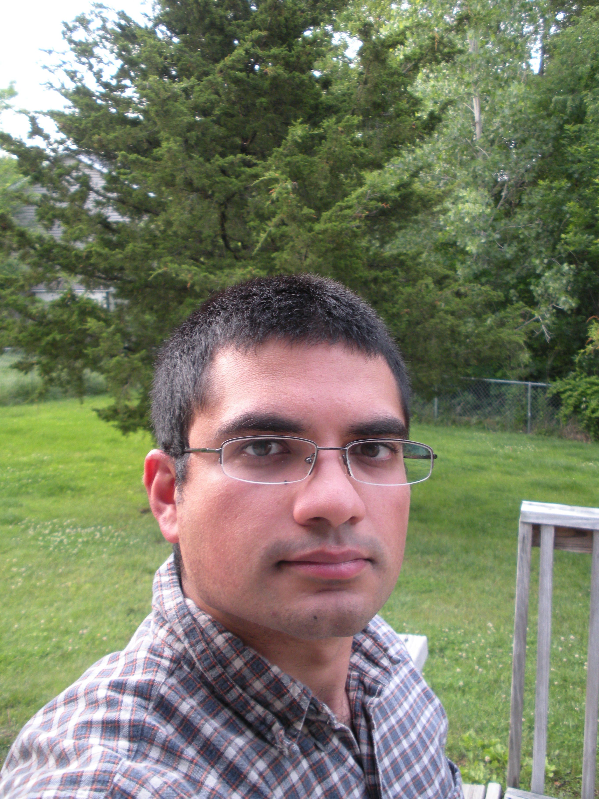

Title: About
page_order: 001
save_as: index.html
url: 

I'm currently a Postdoctoral Fellow in the Computer Science department at the University of Missouri.

I received the Ph.D. in mathematics from the University of Missouri. My thesis advisor was [Prof. S. Dale Cutkosky](http://faculty.missouri.edu/~cutkoskys). I received the B.A. in economics from the University of Cambridge.

People often have trouble figuring out how to pronounce my name. A useful device I've come up with is the following: if you can say **sew me a** *t-shirt*, you're pretty much there\! If you're still uncomfortable with it, you'll be pleased to know that I'm not fussy about how it's pronounced. 

